# pomelo404 — grafo de continuidad

Este archivo es la memoria operativa del proyecto. Debe actualizarse cuando cambien la arquitectura, los estilos globales, el cotizador, el tema o el contenido.

## Estado actual

```mermaid
flowchart TD
  SITE["pomelo404 · Landing Next.js"] --> PAGE["app/page.tsx · composición principal"]
  SITE --> CSS["app/globals.css · identidad y responsive"]
  SITE --> LAYOUT["app/layout.tsx · metadata y fuentes"]
  SITE --> QUOTE["Cotizador modular"]
  SITE --> DEPLOY["Vercel"]
  DEPLOY --> DOMAIN["Dominio principal · www.pomelo404.com"]
  DOMAIN --> CANONICAL["Canonical · https://www.pomelo404.com"]
  SITE --> BRAND["Activos de marca"]
  SITE --> SEO["SEO y social sharing"]
  SITE --> LEGACY["Fallback independiente · /legacy"]

  PAGE --> NAV["Nav + menú móvil"]
  PAGE --> HERO["Hero"]
  PAGE --> MARQUEE["Marquee responsive"]
  PAGE --> PROJECTS["Proyectos · Forma Libre / Faro / Nido"]
  PAGE --> REVIEWS["Reviews"]
  PAGE --> CONTACT["Contacto"]
  PAGE --> QUOTE_VIEW["components/QuoteCalculator.tsx"]

  PROJECTS --> PROJECT_VIEW["components/ProjectShowcase.tsx"]
  PROJECT_VIEW --> PROJECT_DATA["data/projects.ts"]
  PROJECT_DATA --> FORMA["Forma Libre · primer proyecto real"]
  FORMA --> FORMA_CARD["Tarjeta compacta · captura izquierda + diagonal naranja derecha + F cursiva"]
  FORMA --> FORMA_EXPAND["Modal de viewport completo · bloquea scroll de la landing"]
  FORMA_EXPAND --> FORMA_HEADER["Descripción + servicios + enlace + Cerrar"]
  FORMA_EXPAND --> FORMA_EMBED["Iframe lazy de formalibre.mx · desktop y móvil"]
  FORMA_EXPAND --> FORMA_EXIT["Salida · botón Cerrar o Escape"]
  FORMA --> FORMA_ASSET["cover.webp · HD 1780×1080 · WebP · loading eager"]
  FORMA --> FORMA_ANALYTICS["Vercel Analytics · abrir / cerrar / visitar"]

  NAV --> THEME["Botón único · sol / luna"]
  NAV --> MOBILE_CLOSE["Menú móvil · cierra con enlace, clic exterior o Escape"]
  THEME --> AUTO["Automático · prefers-color-scheme"]
  THEME --> MANUAL["Manual · data-theme + localStorage"]
  MANUAL --> RETURN["Segundo clic o cambio del sistema → automático"]

  MARQUEE --> DESKTOP["Desktop · 4 frases completas"]
  MARQUEE --> MOBILE["≤620px · 3 frases cortas"]
  DESKTOP --> LOOP["2 grupos de 100vw · translateX(-50%)"]
  MOBILE --> LOOP

  REVIEWS --> REVIEWS_VIEW["components/ReviewsCarousel.tsx"]
  REVIEWS_VIEW --> REVIEWS_DATA["data/reviews.ts · 8 placeholders"]
  REVIEWS_VIEW --> REVIEWS_MOTION["Autoplay · pausa · flechas · swipe"]
  REVIEWS_MOTION --> REVIEWS_RESPONSIVE["3 desktop · 2 tablet · 1 móvil"]
  REVIEWS_MOTION --> REVIEWS_A11Y["Pause explícita + reduced-motion"]

  QUOTE --> QUOTE_VIEW
  QUOTE_VIEW --> HOOK["hooks/useQuote.ts · estado derivado"]
  HOOK --> PRICING["data/pricing.ts · tipos y precios"]
  HOOK --> QUOTE_DEFAULT["Default · Landing / 1 página / sin extras / normal"]
  PRICING --> LANDING_CURVE["Landing sin extras · 1 pág $8k → 20 págs $91k"]
  PRICING --> OTHER_CURVES["Marca / E-commerce · conservan $3,500 por página extra"]
  HOOK --> LOGIC["lib/quotation.ts · cálculo y mensaje"]
  LOGIC --> WA["WhatsApp · wa.me"]
  WA --> PLACEHOLDER["Número actual es placeholder"]

  CSS --> LIGHT["Light · Mediterránea · :root"]
  CSS --> DARK["Dark · Neón nocturno"]
  CSS --> ACCESS["Contraste + reduced-motion + overflow móvil"]
  CSS --> COMPAT["Compatibilidad progresiva"]
  COMPAT --> FIREFOX["Firefox · range + medidas normalizadas"]
  COMPAT --> SAMSUNG["Samsung Internet · tonos derivados fijos + color-scheme"]
  COMPAT --> OLD["Sin aspect-ratio / Grid · una columna legible"]
  COMPAT --> IE["IE10/11 · lectura estática sin hidratación"]

  LEGACY --> LEGACY_HTML["public/legacy/index.html · contenido"]
  LEGACY --> LEGACY_CSS["public/legacy/legacy.css · CSS tradicional"]
  LEGACY --> LEGACY_JS["public/legacy/legacy.js · cotizador ES5"]
  LEGACY --> LEGACY_ROUTE["next.config.ts · rewrite /legacy"]
  LAYOUT --> LEGACY_DETECT["script nomodule + noscript"]
  LEGACY_DETECT --> LEGACY

  BRAND --> ISO["Isotipo elegido · Pixel"]
  BRAND --> CARDS["Tarjetas de presentación · exploración"]
  CARDS --> CARD_1["01 · Pixel Mediterránea"]
  CARDS --> CARD_2["02 · Neón Nocturno"]
  CARDS --> CARD_3["03 · Editorial Cítrica"]
  CARDS --> CARD_4["04 · Modular Azul"]
  CARDS --> CARD_QR["QR · https://www.pomelo404.com"]
  CARDS --> CARD_STATUS["Estado · pendiente de selección"]
  ISO --> SIGNATURE["Firma de correo HTML"]
  SIGNATURE --> ISO_PNG["pomelo404-pixel-iso.png · 96×96"]
  SIGNATURE --> EMAIL_DATA["hola@pomelo404.com · sitio · CDMX"]

  SEO --> META["layout.tsx · Metadata + Viewport"]
  META --> OG["Open Graph · 3 imágenes 1200×630"]
  META --> TWITTER["Twitter Card · imagen principal"]
  META --> SCHEMA["JSON-LD · ProfessionalService"]
  META --> ROBOTS["Robots + canonical"]

  SOURCE["Fuente de verdad · master 9443c7c + carrusel + Forma Libre"] --> PAGE
  SOURCE --> CSS
  SOURCE --> REVIEWS_VIEW
  SOURCE --> REVIEWS_DATA
```

## Fuente de verdad del último cambio

- Base cotejada: descarga de `master`, commit `9443c7cfd3a0c67ffd6e320e0f1e2811dadcff4c`.
- `app/page.tsx`: conserva la composición actual e integra `ReviewsCarousel`.
- `components/ReviewsCarousel.tsx`: interacción, autoplay, controles, swipe y accesibilidad.
- `data/reviews.ts`: ocho testimonios provisionales separados de la vista.
- `components/ProjectShowcase.tsx`: primer caso real expandible, preview responsive y analítica.
- `data/projects.ts`: contenido y alcance de Forma Libre, además de los placeholders restantes.
- `public/projects/forma-libre/cover.webp`: captura HD de 1780×1080 para la mitad fotográfica de la tarjeta y fallback futuro.
- `app/globals.css`: estilos del carrusel para 3, 2 y 1 tarjetas visibles según el ancho.
- `app/globals.css`: secciones comentadas, colores derivados sin `color-mix()`, controles Firefox y fallbacks progresivos.
- `README-COMPATIBILITY.md`: niveles de soporte, límites de Next.js 16 y protocolo de prueba entre navegadores.
- `public/legacy/`: versión estática sin React con proyectos, reviews, contacto y cotizador básico.
- `app/layout.tsx`: redirección de navegadores sin módulos y visitantes sin JavaScript hacia `/legacy`.
- `next.config.ts`: expone el HTML estático mediante la ruta limpia `/legacy`.

## Contratos que no deben romperse

1. No cambiar los hexadecimales de la paleta Mediterránea en `:root` sin una petición explícita.
2. Sin `data-theme`, el sitio sigue `prefers-color-scheme`.
3. El primer clic aplica el tema manual contrario; el segundo clic vuelve al sistema.
4. Si cambia el tema del sistema, se elimina la preferencia manual y el sitio vuelve al automático.
5. El marquee usa dos grupos idénticos de `100vw` y recorre exactamente `-50%`.
6. Desktop y móvil usan contenidos de marquee distintos; móvil conserva tres frases cortas.
7. El cotizador permanece separado en vista, hook, datos y lógica.
8. El nombre del proyecto es opcional y solo se añade al mensaje si tiene contenido.
9. El número de WhatsApp continúa como placeholder hasta que el usuario proporcione el real.
10. No desplegar ni actualizar Vercel automáticamente; el usuario gestiona el deploy.
11. La firma de correo usa el isotipo Pixel como PNG alojado en el dominio para maximizar compatibilidad.
12. La imagen OG pública debe ser `og-pomelo404-v2.png`; Neón y Editorial permanecen como alternativas no declaradas.
13. El dominio canónico es `https://www.pomelo404.com`; todas las URLs públicas deben usar `www`.
14. Las reviews permanecen como placeholders hasta recibir testimonios autorizados; el carrusel no requiere librerías externas.
15. Los siete colores principales de `:root` permanecen intactos; los tonos secundarios usan variables derivadas fijas.
16. En Samsung Internet se declara `color-scheme` explícitamente para reducir la recolorización automática del navegador.
17. La compatibilidad con IE10/11 es únicamente visual: Next.js 16 no garantiza hidratación ni interacción allí.
18. `/legacy` no depende del bundle de React; su JavaScript debe conservar sintaxis ES5.
19. El número de WhatsApp en la versión completa y legacy debe mantenerse sincronizado.
20. Ninguna propuesta de tarjeta es oficial hasta que el usuario elija una dirección; todas mantienen el QR hacia el dominio canónico.
21. Forma Libre conserva siempre un enlace externo aunque el iframe funcione; el sitio remoto puede cambiar sus políticas de embebido.
22. El iframe de Forma Libre se monta al abrir el modal y ocupa todo el espacio disponible bajo la descripción, tanto en escritorio como en móvil.
23. `layout.tsx`, `package.json` y `pnpm-lock.yaml` gestionan Analytics/Speed Insights por separado y no se sobrescriben desde este módulo.
24. El modal congela la posición de la landing con `body: fixed`, usa foco con `preventScroll` y restaura el punto exacto al cerrar; `Escape` también devuelve el foco a la tarjeta.
25. La captura de Forma Libre usa `loading="eager"` porque Next.js la detecta como elemento LCP; las demás imágenes conservan carga diferida.
26. La landing normal sin extras cuesta $8,000 con una página y $91,000 con veinte; identidad, copy, motion, CMS y entrega express se suman después.
27. El precio por página es específico por tipo: cambiar la curva de landing no debe alterar Sitio de marca ni E-commerce.
28. El menú móvil escucha `pointerdown` únicamente mientras está abierto; clic/touch fuera del nav y del botón lo cierra, y `Escape` devuelve el foco al botón.
29. El cotizador inicia en Landing, una página, sin extras y entrega normal; su estimado visible inicial es $8,000 MXN + IVA.
30. `QuoteCalculator` conserva una key de versión para que el cambio de defaults fuerce un remount y no herede el estado anterior de Fast Refresh.

## Próximos pasos pendientes

- Reemplazar Faro, Nido y las reviews de ejemplo por contenido real autorizado.
- Publicar el metadata corregido con canonical `https://www.pomelo404.com` y una sola imagen `og-pomelo404-v2.png`.
- Imágenes OG actualizadas para mostrar `www.pomelo404.com`.
- Confirmar que `pomelo404.com` redirija de forma permanente a `www.pomelo404.com`.
- Confirmar correo, redes y número de WhatsApp Business.
- Añadir analítica para cotizador, WhatsApp y contacto.
- Verificar visualmente el marquee en iPhone y en anchos de 320, 390, 620 y 1440 px.
- Comparar capturas en Firefox y Samsung Internet con el mismo tema y brillo antes de ajustar nuevamente la paleta.
- Elegir una dirección de tarjeta y preparar el arte final con sangrado, CMYK y especificaciones de imprenta.
