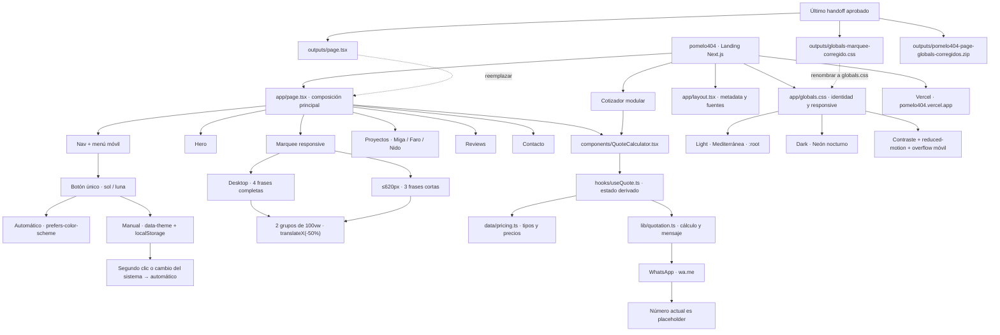

# pomelo404 — grafo de continuidad

Este archivo es la memoria operativa del proyecto. Debe actualizarse cuando cambien la arquitectura, los estilos globales, el cotizador, el tema o el contenido.

## Estado actual

## Fuente de verdad del último cambio

- `outputs/page.tsx`: nav con control de tema, seguimiento de cambios del sistema y dos tracks del marquee.
- `outputs/globals-marquee-corregido.css`: paletas, dark mode, contraste, marquee continuo y reglas móviles.
- `outputs/pomelo404-page-globals-corregidos.zip`: contiene ambos archivos con sus nombres finales para `app/`.
- Los archivos dentro de `app/` pueden permanecer desactualizados hasta que el usuario copie el último handoff.

## Contratos que no deben romperse

1. No cambiar los hexadecimales de la paleta Mediterránea en `:root` sin una petición explícita.
2. Sin `data-theme`, el sitio sigue `prefers-color-scheme`.
3. El primer clic aplica el tema manual contrario; el segundo clic vuelve al sistema.
4. Si cambia el tema del sistema, se elimina la preferencia manual y el sitio vuelve al automático.
5. El marquee usa dos grupos idénticos de `100vw` y recorre exactamente `-50%`.
6. Desktop y móvil usan contenidos de marquee distintos; móvil conserva tres frases cortas.
7. El cotizador permanece separado en vista, hook, datos y lógica.
8. El nombre del proyecto es opcional y solo se añade al mensaje si tiene contenido.
9. El número de WhatsApp continúa como placeholder hasta que el usuario proporcione el real.
10. No desplegar ni actualizar Vercel automáticamente; el usuario gestiona el deploy.

## Próximos pasos pendientes

- Copiar el último `page.tsx` y `globals.css` a `app/` si aún no se ha hecho.
- Reemplazar proyectos y reviews de ejemplo por contenido real autorizado.
- Confirmar correo, redes, dominio y número de WhatsApp Business.
- Añadir analítica para cotizador, WhatsApp y contacto.
- Verificar visualmente el marquee en iPhone y en anchos de 320, 390, 620 y 1440 px.
