# pomelo404 — grafo de continuidad

Este archivo es la memoria operativa del proyecto. Debe actualizarse cuando cambien la arquitectura, los estilos globales, el cotizador, el tema o el contenido.

## Estado actual

```mermaid
flowchart TD
  SITE["pomelo404 · Landing Next.js"] --> PAGE["app/page.tsx · composición principal"]
  SITE --> CSS["app/globals.css · identidad y responsive"]
  SITE --> LAYOUT["app/layout.tsx · metadata y fuentes"]
  SITE --> QUOTE["Cotizador modular"]
  SITE --> DEPLOY["Vercel"]
  DEPLOY --> DOMAIN["Dominio principal · www.pomelo404.com"]
  DOMAIN --> CANONICAL["Canonical · https://www.pomelo404.com"]
  SITE --> BRAND["Activos de marca"]
  SITE --> SEO["SEO y social sharing"]

  PAGE --> NAV["Nav + menú móvil"]
  PAGE --> HERO["Hero"]
  PAGE --> MARQUEE["Marquee responsive"]
  PAGE --> PROJECTS["Proyectos · Miga / Faro / Nido"]
  PAGE --> REVIEWS["Reviews"]
  PAGE --> CONTACT["Contacto"]
  PAGE --> QUOTE_VIEW["components/QuoteCalculator.tsx"]

  NAV --> THEME["Botón único · sol / luna"]
  THEME --> AUTO["Automático · prefers-color-scheme"]
  THEME --> MANUAL["Manual · data-theme + localStorage"]
  MANUAL --> RETURN["Segundo clic o cambio del sistema → automático"]

  MARQUEE --> DESKTOP["Desktop · 4 frases completas"]
  MARQUEE --> MOBILE["≤620px · 3 frases cortas"]
  DESKTOP --> LOOP["2 grupos de 100vw · translateX(-50%)"]
  MOBILE --> LOOP

  REVIEWS --> REVIEWS_VIEW["components/ReviewsCarousel.tsx"]
  REVIEWS_VIEW --> REVIEWS_DATA["data/reviews.ts · 8 placeholders"]
  REVIEWS_VIEW --> REVIEWS_MOTION["Autoplay · pausa · flechas · swipe"]
  REVIEWS_MOTION --> REVIEWS_RESPONSIVE["3 desktop · 2 tablet · 1 móvil"]
  REVIEWS_MOTION --> REVIEWS_A11Y["Pause explícita + reduced-motion"]

  QUOTE --> QUOTE_VIEW
  QUOTE_VIEW --> HOOK["hooks/useQuote.ts · estado derivado"]
  HOOK --> PRICING["data/pricing.ts · tipos y precios"]
  HOOK --> LOGIC["lib/quotation.ts · cálculo y mensaje"]
  LOGIC --> WA["WhatsApp · wa.me"]
  WA --> PLACEHOLDER["Número actual es placeholder"]

  CSS --> LIGHT["Light · Mediterránea · :root"]
  CSS --> DARK["Dark · Neón nocturno"]
  CSS --> ACCESS["Contraste + reduced-motion + overflow móvil"]

  BRAND --> ISO["Isotipo elegido · Pixel"]
  ISO --> SIGNATURE["Firma de correo HTML"]
  SIGNATURE --> ISO_PNG["pomelo404-pixel-iso.png · 96×96"]
  SIGNATURE --> EMAIL_DATA["hola@pomelo404.com · sitio · CDMX"]

  SEO --> META["layout.tsx · Metadata + Viewport"]
  META --> OG["Open Graph · 3 imágenes 1200×630"]
  META --> TWITTER["Twitter Card · imagen principal"]
  META --> SCHEMA["JSON-LD · ProfessionalService"]
  META --> ROBOTS["Robots + canonical"]

  SOURCE["Fuente de verdad · master 9443c7c + carrusel"] --> PAGE
  SOURCE --> CSS
  SOURCE --> REVIEWS_VIEW
  SOURCE --> REVIEWS_DATA
```

## Fuente de verdad del último cambio

- Base cotejada: descarga de `master`, commit `9443c7cfd3a0c67ffd6e320e0f1e2811dadcff4c`.
- `app/page.tsx`: conserva la composición actual e integra `ReviewsCarousel`.
- `components/ReviewsCarousel.tsx`: interacción, autoplay, controles, swipe y accesibilidad.
- `data/reviews.ts`: ocho testimonios provisionales separados de la vista.
- `app/globals.css`: estilos del carrusel para 3, 2 y 1 tarjetas visibles según el ancho.

## Contratos que no deben romperse

1. No cambiar los hexadecimales de la paleta Mediterránea en `:root` sin una petición explícita.
2. Sin `data-theme`, el sitio sigue `prefers-color-scheme`.
3. El primer clic aplica el tema manual contrario; el segundo clic vuelve al sistema.
4. Si cambia el tema del sistema, se elimina la preferencia manual y el sitio vuelve al automático.
5. El marquee usa dos grupos idénticos de `100vw` y recorre exactamente `-50%`.
6. Desktop y móvil usan contenidos de marquee distintos; móvil conserva tres frases cortas.
7. El cotizador permanece separado en vista, hook, datos y lógica.
8. El nombre del proyecto es opcional y solo se añade al mensaje si tiene contenido.
9. El número de WhatsApp continúa como placeholder hasta que el usuario proporcione el real.
10. No desplegar ni actualizar Vercel automáticamente; el usuario gestiona el deploy.
11. La firma de correo usa el isotipo Pixel como PNG alojado en el dominio para maximizar compatibilidad.
12. La imagen OG pública debe ser `og-pomelo404-v2.png`; Neón y Editorial permanecen como alternativas no declaradas.
13. El dominio canónico es `https://www.pomelo404.com`; todas las URLs públicas deben usar `www`.
14. Las reviews permanecen como placeholders hasta recibir testimonios autorizados; el carrusel no requiere librerías externas.

## Próximos pasos pendientes

- Reemplazar proyectos y reviews de ejemplo por contenido real autorizado.
- Publicar el metadata corregido con canonical `https://www.pomelo404.com` y una sola imagen `og-pomelo404-v2.png`.
- Imágenes OG actualizadas para mostrar `www.pomelo404.com`.
- Confirmar que `pomelo404.com` redirija de forma permanente a `www.pomelo404.com`.
- Confirmar correo, redes y número de WhatsApp Business.
- Añadir analítica para cotizador, WhatsApp y contacto.
- Verificar visualmente el marquee en iPhone y en anchos de 320, 390, 620 y 1440 px.
