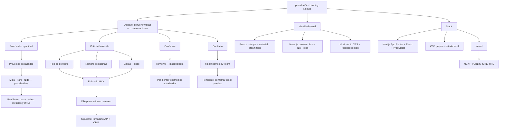

# pomelo404 — mapa de continuidad

Este archivo es la memoria operativa del proyecto. Actualízalo cuando cambie el alcance, el contenido o la arquitectura.

## Reglas de producto

- La cotización es orientativa; nunca prometer precio final sin revisar alcance.
- El CTA principal siempre lleva al cotizador.
- Cada proyecto real debe incluir reto, solución, resultado y enlace.
- Los reviews requieren nombre, cargo y autorización del cliente.
- Mantener accesibilidad de teclado, contraste y `prefers-reduced-motion`.

## Próximas decisiones

1. Reemplazar los tres proyectos y reviews de ejemplo por contenido real.
2. Confirmar correo, redes y URL final.
3. Definir si la cotización se guarda en un CRM, se envía por email o ambas.
4. Añadir analítica de `inicio_cotizador`, `cotizacion_generada` y `contacto_enviado`.
5. Conectar el dominio a Vercel y cargar `NEXT_PUBLIC_SITE_URL`.
